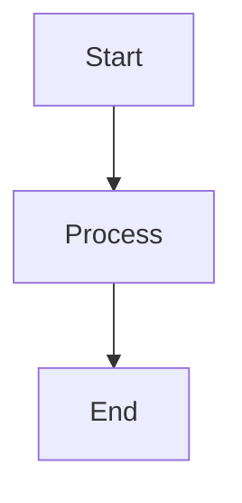

# mod_mermaid

An Apache module for dynamically rendering [Mermaid](https://mermaid-js.github.io/mermaid/) diagram files (`.mmd`) as SVG directly in the browser. This module allows you to serve Mermaid diagrams without generating static HTML pages or caching SVG files, ensuring diagrams are always up-to-date and rendered on-the-fly.

## Features
- **Dynamic Rendering**: Converts `.mmd` files to SVG diagrams in real-time using the Mermaid CLI (`mmdc`).
- **No Caching**: Always serves the latest version of your diagrams, avoiding outdated cached files.
- **Lightweight**: Requires only Apache and the Mermaid CLI, with no additional tools or dependencies.
- **Intranet-Friendly**: Ideal for intranet environments where users want to view `.mmd` files directly in a browser.
- **Secure**: Uses safe execution methods (`fork`/`exec`) to prevent command injection vulnerabilities.

## Prerequisites
To use `mod_mermaid`, you need the following installed on your system:
- **Apache HTTP Server** (2.4 or later) with development tools (`apxs`).
- **Mermaid CLI** (`mmdc`): Installed via npm.
- **Chromium** (or Chrome): Required by Mermaid CLI for rendering diagrams.
- **APR** (Apache Portable Runtime) and development headers.

## Installation

### Step 1: Install Dependencies
1. **Install Apache and Development Tools**:
   On Debian/Ubuntu:
   ```bash
   sudo apt update
   sudo apt install apache2 apache2-dev
   ```

2. **Install Mermaid CLI**:
   Install Node.js and npm, then install the Mermaid CLI globally:
   ```bash
   sudo apt install nodejs npm
   npm install -g @mermaid-js/mermaid-cli
   ```

3. **Install Chromium**:
   Install Chromium (or Chrome) and configure Puppeteer:
   ```bash
   sudo apt install chromium
   export PUPPETEER_EXECUTABLE_PATH=/usr/bin/chromium
   export PUPPETEER_CACHE_DIR=/var/cache/puppeteer
   npx puppeteer browsers install chrome-headless-shell
   ```

   Add these environment variables to Apache's configuration for persistence:
   ```bash
   sudo nano /etc/apache2/envvars
   ```
   Append:
   ```bash
   export PUPPETEER_EXECUTABLE_PATH=/usr/bin/chromium
   export PUPPETEER_CACHE_DIR=/var/cache/puppeteer
   ```

### Step 2: Compile and Install the Module
1. Clone this repository:
   ```bash
   git clone https://github.com/ecxod/mod_mermaid.git
   cd mod_mermaid
   ```

2. Compile and install the module using `apxs`:
   ```bash
   apxs -c -i mod_mermaid.c
   ```

3. Enable the module in Apache:
   ```bash
   sudo a2enmod mermaid
   ```

4. Restart Apache to apply changes:
   ```bash
   sudo service apache2 restart
   ```

### Step 3: Configure Apache
To enable `mod_mermaid` for `.mmd` files, add the following to your Apache configuration (e.g., `/etc/apache2/sites-available/000-default.conf` or a dedicated configuration file like `/etc/apache2/mods-available/mermaid.conf`):

```apache
<FilesMatch "\.mmd$">
    SetHandler mermaid
</FilesMatch>
```

If you created a separate configuration file, enable it:
```bash
sudo a2enconf mermaid
sudo service apache2 restart
```

Ensure that the directory containing your `.mmd` files is accessible to the Apache user (`www-data` on Debian/Ubuntu):
```bash
sudo chmod -R o+r /path/to/your/mmd/files
sudo chown -R www-data:www-data /var/cache/puppeteer
sudo chmod -R u+rw /var/cache/puppeteer
```

## Installing via Debian Package
1. Download the latest `.deb` package from the [Releases](https://github.com/ecxod/mod_mermaid/releases) page.
2. Install the package:
   ```bash
   sudo dpkg -i mod-mermaid_1.0-1_amd64.deb
   sudo apt install -f

## Usage

1. Place your Mermaid diagram files (`.mmd`) in a directory served by Apache (e.g., `/var/www/html/diagrams/`).
2. Access the `.mmd` file via your browser, e.g., `http://your-server/diagrams/FlowChart.mmd`.
3. The module will render the diagram as an SVG embedded in a simple HTML page.

Example `.mmd` file (`FlowChart.mmd`):

## JavaScript-Free Diagram Rendering for Console Browsers

`mod_mermaid` is perfect for serving Mermaid diagrams without relying on client-side JavaScript, making it ideal for lightweight or text-based browsers like `w3m`, `lynx`, or other minimalistic clients. By rendering `.mmd` files as SVGs server-side, the module ensures that diagrams are accessible in environments where JavaScript is disabled or unavailable, such as:

- **Console Browsers**: Tools like `w3m` (with SVG support) can display diagrams directly in the terminal.
- **Low-Resource Devices**: Embedded systems or legacy clients benefit from pre-rendered SVGs.
- **Security-Conscious Environments**: Avoid JavaScript to reduce attack surfaces in sensitive intranet setups.

### How It Works
1. Place your `.mmd` files in an Apache-served directory.
2. Configure Apache to use the `mermaid` handler for `.mmd` files (see [Installation](#installation)).
3. Access the diagram via a URL (e.g., `http://your-server/diagrams/FlowChart.mmd`) in a console browser like `w3m`:
   ```bash
   w3m http://your-server/diagrams/FlowChart.mmd
   ```
4. The module converts the `.mmd` file to an SVG embedded in a simple HTML page, which is rendered without any client-side JavaScript.

## Benefits

- No JavaScript Overhead: Diagrams are fully rendered on the server, ensuring compatibility with JavaScript-free clients.
- Lightweight: Minimal HTML and SVG output keeps pages fast and accessible.
- Broad Compatibility: Works with any browser or client that supports basic HTML and SVG, including terminal-based tools.

## Notes

- Ensure your console browser (e.g., w3m) is compiled with SVG support for optimal rendering. Check your browser's documentation for details.
- For the best experience, keep .mmd diagrams simple, as complex SVGs may challenge some text-based browsers.

This feature makes mod_mermaid a versatile tool for delivering dynamic diagrams in constrained or security-focused environments.


## Troubleshooting
- **Check Apache Logs**: If diagrams fail to render, check the Apache error logs for details:
  ```bash
  tail -f /var/log/apache2/error.log
  ```
- **Verify Mermaid CLI**: Test `mmdc` manually as the Apache user:
  ```bash
  sudo -u www-data /usr/local/bin/mmdc -i /path/to/diagram.mmd -o /tmp/test.svg
  ```
- **Permissions**: Ensure the Apache user (`www-data`) has read access to `.mmd` files and write access to `/var/cache/puppeteer`.
- **Environment Variables**: Confirm that `PUPPETEER_EXECUTABLE_PATH` and `PUPPETEER_CACHE_DIR` are set in `/etc/apache2/envvars`.

## Contributing
Contributions are welcome! Please submit a pull request or open an issue on GitHub to suggest improvements or report bugs.

## License
This project is licensed under the [MIT License](LICENSE).

## Acknowledgments
- Built with the [Mermaid CLI](https://github.com/mermaid-js/mermaid-cli) for diagram rendering.
- Inspired by the need for a simple, dynamic way to view Mermaid diagrams in an intranet environment.

---

Happy diagramming! 🚀